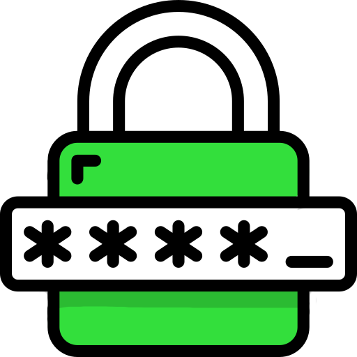

# Password Quest

  

  Unity Project for privacy literacy
   
  internship project for
   
  Bachelor Degree in computer science 
   
  at University of Salerno.

This project is part of [Being Digital](https://github.com/MichelaFaella/BeingDigital).

## Authors

* **Michela Faella** - *Developer* - [MichelaFaella](https://github.com/MichelaFaella)
* **Lorenzo Sorrentino** - *Developer* - [losor2002](https://github.com/losor2002)

## Built With

* [Unity](https://unity.com/) - The game engine used for the development.
* [C#](https://learn.microsoft.com/it-it/dotnet/csharp/) - The programming language used for the development.
* [Pixel Art Top Down - Basic](https://assetstore.unity.com/packages/2d/environments/pixel-art-top-down-basic-187605) - The package used for the environment.
